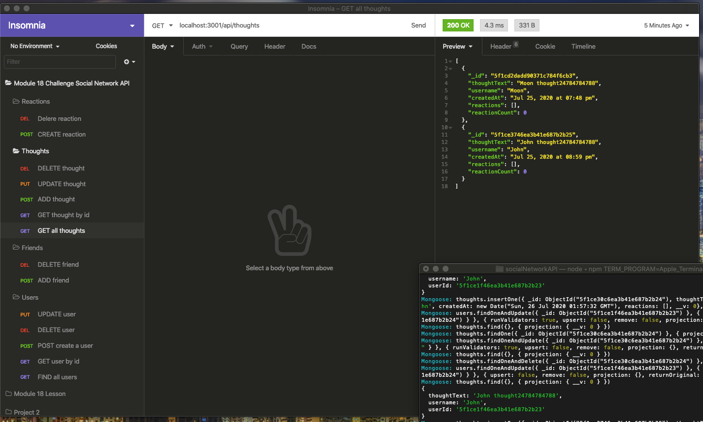

# Social Network API

## Description
An API for a social network web application where users can share their thoughts, react to friends’ thoughts, and create a friend list.
## Table of Contents
* [Installation](#installation)
* [Usage](#usage)
* [Video](#video)
* [License](#license)
* [Credits](#credits)
* [Tests](#tests)
* [Questions](#questions)
## Installation
clone repo and install npm dependencies.
## Usage
None at the moment.
### Image:

## Video
Below are two links to a walkthrough video demonstrating the functionality of the social network api routes and models.
* [Video Part 1](https://drive.google.com/file/d/1ZRKNUFpbWkJupD889ttKbT-DA8P3oLhs/view)
* [Video Part 2](https://drive.google.com/file/d/1gL89o_QhAKK5hnE_zo4UWp2yVjn9eMOM/view)
## License
Licensed under MIT.
## Credits
* W3Schools www.w3schools.com/  
* Stack OverFlow www.stackoverflow.com/
## Tests
N/A
## Questions
Please feel free to contact me. GitHub & LinkedIn links provided below along with my Email.
* [GitHub](github.com/saul10huerta)
* [Email](saul10huerta@utexas.edu)
* [LinkedIn](https://www.linkedin.com/in/saul10huerta/)